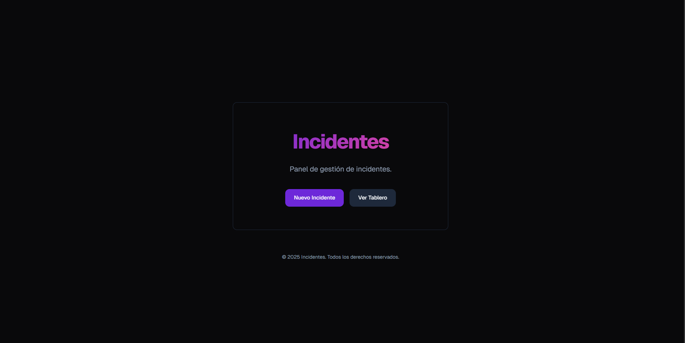

# Sistema de Gestión de Incidentes

Aplicación web moderna para el seguimiento y gestión de incidentes técnicos, construida con Next.js y Turso (base de datos en la nube).



## 🚀 Características

- **Dashboard de Incidentes**: Vista dual (Cuadrícula y Tabla) para visualizar todos los reportes.
- **Gestión Completa**: Crear, visualizar detalles, actualizar estado y eliminar incidentes.
- **Filtrado Avanzado**: Búsqueda por texto, filtrado por prioridad y fecha.
- **UI Moderna**: Interfaz diseñada con estilo Glassmorphism, animaciones fluidas y diseño responsivo.
- **Actualizaciones en Tiempo Real**: Feedback inmediato al usuario mediante notificaciones toast.
- **Base de Datos en la Nube**: Datos almacenados en Turso para acceso desde cualquier lugar.

## 🛠️ Tecnologías Utilizadas

- **Framework Principal**: [Next.js 15](https://nextjs.org/) (App Router, Server Components & Server Actions)
- **Lenguaje**: [TypeScript](https://www.typescriptlang.org/)
- **Base de Datos**: [Turso](https://turso.tech/) (SQLite en la nube)
- **Cliente de BD**: [@libsql/client](https://github.com/tursodatabase/libsql-client-ts)
- **Estilos**: CSS Modules / Vanilla CSS con diseño Glassmorphism
- **Iconos**: SVG nativos

## 📋 Requisitos Previos

- Node.js 18.17.0 o superior
- npm (o yarn/pnpm)
- Cuenta en [Turso](https://turso.tech/) (gratuita)

## 🔧 Instalación y Configuración

### 1. Clonar el repositorio

```bash
git clone <url-del-repositorio>
cd incidentes
```

### 2. Instalar dependencias

```bash
npm install
```

### 3. Configurar Turso

#### a) Instalar el CLI de Turso (opcional, pero recomendado)

```bash
npm install -g @turso/cli
```

#### b) Crear una base de datos en Turso

Opción 1: Desde el [panel web de Turso](https://turso.tech/app)

- Crea una nueva base de datos
- Copia la URL de conexión
- Genera un token de autenticación

Opción 2: Usando el CLI de Turso

```bash
# Autenticarse
turso auth login

# Crear base de datos
turso db create mi-incidentes-db

# Obtener la URL
turso db show mi-incidentes-db

# Crear token de autenticación
turso db tokens create mi-incidentes-db
```

### 4. Configurar Variables de Entorno

Crea un archivo `.env.local` en la raíz del proyecto:

```env
DATABASE_URL="libsql://tu-database.turso.io"
TURSO_AUTH_TOKEN="tu-token-de-autenticacion"
```

### 5. Inicializar la Base de Datos

Ejecuta el script SQL para crear la tabla en Turso:

```bash
turso db shell tu-database < init-turso.sql
```

O manualmente desde el panel de Turso, ejecuta:

```sql
CREATE TABLE IF NOT EXISTS "Incident" (
    "id" INTEGER NOT NULL PRIMARY KEY AUTOINCREMENT,
    "title" TEXT NOT NULL,
    "description" TEXT NOT NULL,
    "status" TEXT NOT NULL DEFAULT 'Abierto',
    "severity" TEXT NOT NULL DEFAULT 'Media',
    "createdAt" DATETIME NOT NULL DEFAULT CURRENT_TIMESTAMP,
    "updatedAt" DATETIME NOT NULL
);
```

### 6. Generar el Cliente de Prisma

```bash
npx prisma generate
```

## ▶️ Ejecución

Para iniciar el servidor de desarrollo:

```bash
npm run dev
```

La aplicación estará disponible en [http://localhost:3000/incidentes](http://localhost:3000/incidentes).

## 📂 Estructura del Proyecto

```
incidentes/
├── src/
│   ├── app/
│   │   ├── incidentes/
│   │   │   ├── page.tsx              # Página principal (Server Component)
│   │   │   ├── incident-list.tsx     # Componente cliente con UI y filtros
│   │   │   ├── actions.ts            # Server Actions (CRUD)
│   │   │   └── nuevo/
│   │   │       └── page.tsx          # Formulario de nuevo incidente
│   │   └── api/
│   │       └── incidentes/
│   │           └── route.ts          # API Routes
│   ├── lib/
│   │   └── prisma.ts                 # Cliente de base de datos (LibSQL)
│   └── img/
│       └── incidentes.png            # Screenshot
├── prisma/
│   └── schema.prisma                 # Esquema de la base de datos
├── init-turso.sql                    # Script de inicialización de BD
└── package.json
```

## 🗄️ Esquema de Base de Datos

### Modelo `Incident`

| Campo       | Tipo     | Descripción                         |
| ----------- | -------- | ----------------------------------- |
| id          | INTEGER  | ID único (auto-incremental)         |
| title       | TEXT     | Título del incidente                |
| description | TEXT     | Descripción detallada               |
| status      | TEXT     | Estado (Abierto, En Progreso, etc.) |
| severity    | TEXT     | Severidad (Baja, Media, Alta)       |
| createdAt   | DATETIME | Fecha de creación                   |
| updatedAt   | DATETIME | Fecha de última actualización       |

## 🔍 Scripts Útiles

### Verificar conexión a Turso

```bash
node --env-file=.env.local test-turso.mjs
```

### Ver datos en Turso

```bash
node --env-file=.env.local check-turso-data.mjs
```

### Acceder a la shell de Turso

```bash
turso db shell tu-database
```

## 🚀 Despliegue

### Vercel (Recomendado)

1. Sube tu proyecto a GitHub
2. Importa el proyecto en [Vercel](https://vercel.com)
3. Configura las variables de entorno:
   - `DATABASE_URL`
   - `TURSO_AUTH_TOKEN`
4. Despliega

### Otras Plataformas

Asegúrate de configurar las variables de entorno en tu plataforma de hosting.

## 🤝 Contribuir

1. Haz un Fork del proyecto
2. Crea una rama para tu característica (`git checkout -b feature/AmazingFeature`)
3. Commit de tus cambios (`git commit -m 'Add some AmazingFeature'`)
4. Push a la rama (`git push origin feature/AmazingFeature`)
5. Abre un Pull Request

## 📝 Notas Técnicas

- **Next.js 15**: Se usa Next.js 15 en lugar de 16 para mejor compatibilidad con LibSQL
- **LibSQL Directo**: Se usa `@libsql/client` directamente en lugar del adaptador de Prisma para evitar problemas de empaquetado
- **Serialización**: Los resultados de la base de datos se convierten a objetos planos para compatibilidad con React Server Components

## 📄 Licencia

Distribuido bajo la licencia MIT.

---

Desarrollado con ❤️ usando Next.js y Turso
